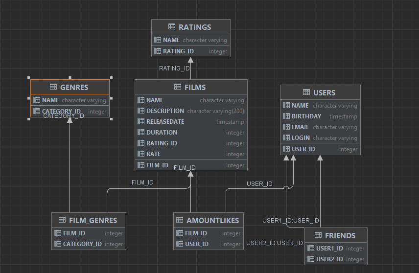

# java-filmorate
Filmorate - это бэкенд-приложени, который предоставляет доступ к фильмам и оценкам пользователей.
Пользователям досупны множество функций (создание нового фильма, вывод топ N лучших фильмов, добавление пользователей 
в друзья и многое другое).

Технологический стек: Java 11, REST-сервис на базе Spring Boot, Maven, Lombok, Базы данных, SQL, H2

Описание схемы для базы данных приложения Filmorate

1) Таблица film

   В данной таблице представлена вся информация о фильме. В качестве первичного ключа выступает колонка с название 
   film_id. Также film_id связан с таблицами film_category и amountLikes по принципу "один ко многим".
   Колонки name, description, releaseDate, duration - колонки со своими типами данных. Колонка rating_id 
   указывает на id рейтинга. Само имя рейтинга представлено в таблице ratings.
2) Таблицы film_category и category

   Таблица film_category хранить уникальную связку первичных ключей из колонок film_id и category_id. Это сделанно для 
   того, чтобы нельзя было добавить к фильму два раза одну и ту же категорию.
   Таблциа category
   В данной таблице представлено два столбца. category_id - первичный ключ. name - название категории. Таблицы film и 
   category связаны по принципу многие ко многим (у одного фильма может быть несколько категорий, у одной категории 
   может быть несколько фильмов)

3) Таблица ratings

Таблица хранит в себе id рейтинга и имя самого рейтинга.

4) Таблица AmountLikes

Таблица хранить уникальную связку первичных ключей из колонок film_id и user_id. Это сделанно для того, чтобы  у фильма 
были уникальные лайки (один пользователь = один лайк к фильму).

5) Таблица user

У данной таблицы user_id - первичный ключ. Остальные со своими типами данных.

6) Таблица friends

Таблица содержит связку первичных ключей (user1, user2). Это сделано для того, чтобы id пользователей не дублировались 
в друзьях
Статус Дружба. Данный статус будет вынесен в класс UserService и будет определяться следующим образом.
Статус будет "подтвержденный", если в таблице friends у пользователя с id1 будет в друзьях пользователь с id2 
и наоборот:

user_id1 | user_id2

...................

...................

user_id2 | user_id1

Если такая связка в таблице будет отсутствовать, то статус у пользователей user_id1 и user_id2 будет "неподтвержденный".
